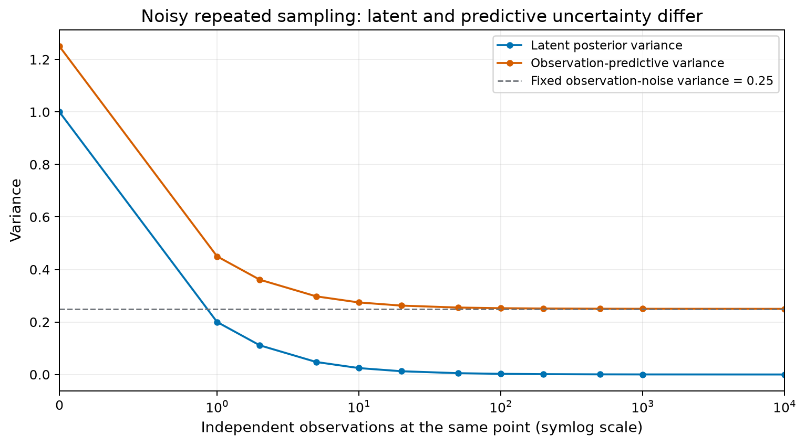
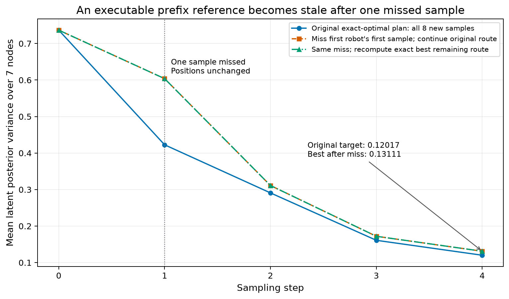
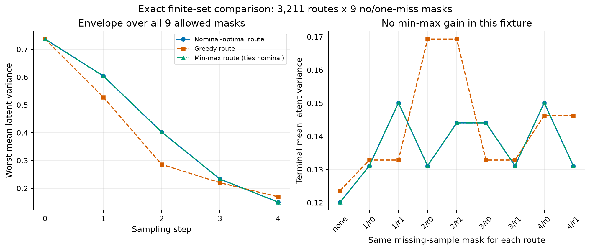

# GP Attainability: çalıştırılmış küçük sayısal teşhis

Bu paket Hatanaka başvurusu için düşünülen araştırma yönünün bazı temel varsayımlarını sınayan **makaleden bağımsız bir exact-GP deneyidir**. ECC 2025 yeniden üretimi, SOGP uygulaması, yeni yöntemin kanıtı veya başvuruya hazır araştırma sonucu değildir. Büyük proje başlamadan önce hangi belirsizlik tanımlarının ve iddiaların doğru olduğunu kontrol eden ilk teknik çıktıdır.

## Çalıştırma

Python 3.10+ ve NumPy yeterlidir. Eğitim, GPU, internet veya SciPy gerekmez:

```powershell
python diagnostic.py
python -m unittest -v
```

İsteğe bağlı figürler için Matplotlib kurulu bir ortamda:

```powershell
python plot_figures.py
```

Bu paketteki sonuçlar 8 Eylül 2026'da Python 3.12.14 / NumPy 2.3.5 ile üretildi. **11 test geçti.** Ana deney yaklaşık **0,18 saniye** sürdü; bu yalnız bu küçük örneğin gözlemi, büyük araştırma için performans garantisi değildir. Grafikler ayrı Matplotlib ortamıyla kayıtlı verilerden çizilir.

## Sabit deney

- Yedi düğümlü 1D zincir: 0, 1, 2, 3, 4, 5, 6.
- Etiketli iki robot; başlangıç konumları 1 ve 5; düğüm 3'te bir geçmiş ölçüm.
- Dört hareket/örnekleme adımı. Robot adımda en fazla bir kenar ilerler veya bekler; her hareketten sonra örnek alır.
- Aynı düğümde buluşma ve iki robotun yer değiştirmesi yasak. Zincirin kenarları üzerindeki bu geometrik koşul fiziksel dinamik modelin güvenlik kanıtı değildir.
- RBF kernel: sinyal varyansı 1, uzunluk ölçeği 1,3; bağımsız ölçüm gürültüsü varyansı 0,25. Parametre öğrenilmez.
- Amaç: yedi düğümdeki **latent posterior variance** değerlerinin aritmetik ortalaması. Buradaki “integrated variance” bu sonlu eşit ağırlıklı toplamdır; sürekli alan integrali değildir.
- Tüm **3.211** geçerli ortak rota listelenir. Nominal durumda her rota sekiz yeni ölçüm kullanır.

## Sonuç 1 — “Gürültü varsa varyans sıfıra gidemez” tek başına yeterli değil

Aynı noktada bağımsız gürültülü tekrarlı ölçümler için:

`latent_variance(n) = 1 / (1 / prior_variance + n / noise_variance)`

`predictive_variance(n) = latent_variance(n) + noise_variance`

10.000 ölçümde latent varyans yaklaşık **0,000025**, predictive varyans yaklaşık **0,250025**. Gürültü, bu modelde aynı noktadaki latent varyansın sıfıra yaklaşmasını engellemez. Predictive varyans gürültü terimini içerir. Bu sonuç bütün alanın sınırlı bütçeyle öğrenilebileceğini söylemez; ECC makalesinin hangi varyansı kullandığını da belirlemez. Makalenin tanımı tam metinden doğrulanmalıdır.



## Sonuç 2 — Yürütülebilir rota, optimumla aynı şey değil

| Planlayıcı | Terminal ortalama latent varyans |
|---|---:|
| Bütün rotalar üzerinden tam minimum | 0,1201713679 |
| Her adımda bir sonraki örneklerin kazancını maksimize eden greedy | 0,1236389162 |

Bir yürütülebilir rotanın sonucu, minimum terminal amaç değerinin **üstten aday sınırıdır**. Buna “ulaşılabilecek en düşük varyans” veya “gerçek belirsizlik tabanı” denemez. Tam optimum burada yalnız sonlu aday kümesi bütünüyle tarandığı için bilinir.

## Sonuç 3 — Eski prefix referansı bir örnek kaybıyla geçersizleşebilir

Nominal optimal rotanın ilk adımında robot 0'ın ölçümü bilerek kaybedilir; robotun gerçek konumu değişmez. Eski program sekiz yeni ölçüm öngörür; stres deneyinde yedisi gerçekleşir. Kalan üç adım ve altı ölçümlük program korunur. Bu, eşit gerçekleşmiş veri bütçesiyle bir üstünlük karşılaştırması değildir: **yürütme kaybını teşhis eden stres testidir**.

- Eski terminal hedefi: **0,1201713679**.
- Gerçekleşmiş veriden ve gerçek robot konumlarından yeniden hesaplanan en iyi kalan hedef: **0,1311128159**.
- Fark: **0,0109414480**.

Kalan tüm geçerli rotalar da tarandığından, eski hedefin bu sonlu modelde ve kalan bütçede artık ulaşılamaz olduğu gösterilir. Daha yüksek bir referansa geçmek alan kestirimini iyileştirmiş sayılmaz; kaybedilen bilgiye uygun hedef bildirir. Eski rotaya devam etme ve yeniden planlama eğrileri ayrı kaydedilir. Bu karşılaştırma bir feedback-optimality teoremi değildir.

Bu örnekte eski rotanın kalan kısmı da yeniden hesaplanan optimumla aynı sonucu verdi: **yeniden planlama kazancı yok**. Değişen şey doğru terminal hedefidir.



## Sonuç 4 — Küçük min-max deneyi: iyileşme çıkmadı

Her sabit rota için aynı dokuz durum sınanır: ölçüm kaybı yok veya sekiz robot-adım ölçümünden tam biri kayıp. **3.211 × 9 = 28.899** rota/durum çifti değerlendirilir. Amaç, rotanın bu sonlu kümedeki en kötü terminal latent varyansını azaltmaktır.

**Nominal-optimal ve min-max-optimal rotalar bu örnekte aynı çıktı.** İkisinin en kötü terminal varyansı **0,1501056447**. Min-max yönünde bir iyileşme bulunmadı; olumlu sonuç yaratmak için konfigürasyon taranmadı.

Rota başına prefix envelope, her prefix'te izin verilen dokuz maskenin maksimumudur. Dolayısıyla belirtilen sabit kernel/noise, tam konumlar ve en fazla bir kayıp varsayımları altında bu sonlu durum kümesindeki bütün posterior-varyans eğrilerini kapsar. Bu, hesaplanan sonlu küme için doğruluk sınırıdır; rastgele dropout oranı, sürekli kontrol, model hatası, sparse-GP yaklaşımı veya fiziksel güvenlik garantisi değildir. Rotalar açık döngüdür; adaptif feedback politika optimumu aranmaz.



## Testler neyi denetliyor?

1. Batch Cholesky posterior kovaryans ile ardışık Gaussian conditioning eşitliği; tekrarlı ve eşzamanlı noktalar dahil.
2. Bağımsız ölçümlerin işlenme sırasına göre kovaryansın değişmemesi.
3. Gürültülü skaler tekrarlı gözlemin analitik varyans formülü.
4. Posterior kovaryansın pozitif yarı tanımlı olması ve bilginin artmasıyla azalması.
5. Geçersiz hızlı hareket, aynı düğüm çarpışması ve swap reddi.
6. Ortak ardıl durumların bağımsız Cartesian kontrolü.
7. Daha küçük bir örnekte rota listesinin bağımsız tam enumeration ile eşitliği.
8. Bulunan minimumun bütün adaylardan ve greedy sonucundan büyük olmaması.
9. Kayıp örnek sonrası stale reference ve gerçek kalan bütçe.
10. Min-max sonucunun bütün alternatif rotalardaki worst-case değerden büyük olmaması.
11. Dokuz durumun doğru üretilmesi ve prefix envelope'un her durumu kapsaması; masked prefix'lerin bağımsız sequential conditioning kontrolü.

## Dosyalar ve iddia sınırı

- `config.json`: sabit deney tanımı.
- `diagnostic.py`: NumPy-only hesaplama; yeniden çalıştırma bu klasördeki üretilmiş JSON/CSV dosyalarını yeniler.
- `test_diagnostic.py`: unittest kontrolleri.
- `metrics.json`: sayısal sonuçlar, rotalar, prefix eğrileri, tüm maskeler ve ortam.
- `repeated_samples.csv`, `route_prefixes.csv`, `covariance_arrays.csv`, `matched_dropout_scenarios.csv`: denetlenebilir sayısal diziler.
- `plot_figures.py`: sonuçları değiştirmeden Matplotlib PNG/SVG figürleri üretir.

Bu deneyde gerçek scalar field değerleri, posterior mean/RMSE, robot dinamiği, QP/CBF, online sparse-GP, kernel öğrenme, dağıtık iletişim veya ECC denklemleri yoktur. Sabit GP kernel'inde posterior covariance gözlem değerlerinden bağımsız olduğundan `y` üretilmemiştir. Bu paket bu nedenle **model belirsizliği** hesaplar; fiziksel alan kestirim başarısı göstermez.

Bir sonraki bilimsel kapı ECC tam metninden objective/variance/SOGP/controller tanımlarını çıkarmak, ardından paper-aligned temel sonucu üretmektir. Buradaki min-max ties ve stale-reference örneği, yeni yöntemin başarılı olduğu yerine hangi varsayımların test edilmesi gerektiğini söyler.


Matematiksel temel: [Rasmussen ve Williams, Gaussian Processes for Machine Learning, Bölüm 2](https://gaussianprocess.org/gpml/chapters/RW2.pdf). Rota modeli, deney konfigürasyonu ve kayıp senaryoları bu bağımsız diagnostic için oluşturuldu; Hatanaka makalesinden alınmadı.
